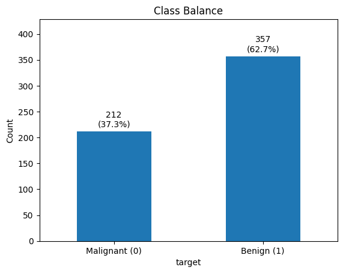
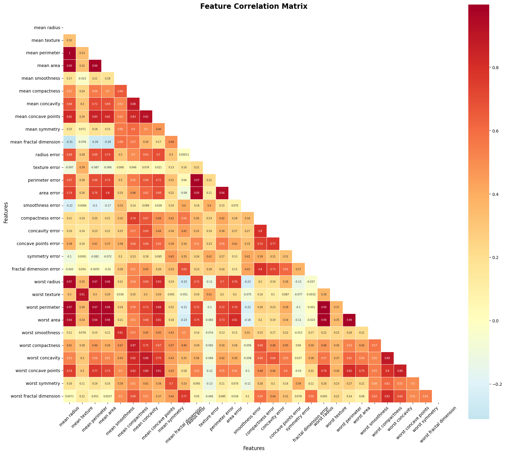

# Privacy-Preserving Federated Learning for Breast Cancer Classification

[](https://www.python.org/downloads/)
[](https://pytorch.org/)
[](https://flower.dev/)
[](https://opensource.org/licenses/MIT)

A federated learning implementation for breast cancer classification using the Wisconsin Diagnostic Breast Cancer dataset, featuring differential privacy mechanisms and non-IID data distribution simulation across multiple hospitals.

## Table of Contents

- [Overview](#overview)
- [Features](#features)
- [Installation](#installation)
- [Usage](#usage)
- [Dataset Analysis](#dataset-analysis)
- [Model Architecture](#model-architecture)
- [Results](#results)
- [Project Structure](#project-structure)
- [References](#references)
- [License](#license)

## Overview

This project simulates privacy-preserving federated learning across two "hospitals" using the Breast Cancer Wisconsin (Diagnostic) dataset. The implementation compares centralized training against federated learning with and without differential privacy, demonstrating real-world healthcare data collaboration scenarios without compromising patient privacy.

### Key Objectives

- Implement federated learning without raw data sharing
- Add differential privacy layer for enhanced privacy protection  
- Compare federated vs. centralized training performance
- Document privacy-utility trade-offs
- Simulate realistic hospital data heterogeneity (non-IID)

## Features

- **Multi-Hospital Simulation**: Realistic federated learning across hospital networks
- **Differential Privacy**: Configurable privacy mechanisms with ε-δ guarantees
- **Non-IID Data Distribution**: Simulates real-world data heterogeneity
- **GPU Acceleration**: CUDA support for faster training
- **Comprehensive Analytics**: Detailed performance metrics and visualizations
- **Configurable Architecture**: Flexible MLP with dropout regularization
- **Flower Integration**: Built on Flower federated learning framework

## Installation

### Prerequisites

- Python 3.8+
- CUDA-compatible GPU (optional, for acceleration)

### Setup

1. **Clone the repository**
   ```bash
   git clone https://github.com/starbachi/Breast-Cancer-Wisconsin.git
   cd Breast-Cancer-Wisconsin
   ```

2. **Create virtual environment**
   ```bash
   python3 -m venv venv
   source venv/bin/activate
   ```

3. **Install dependencies**
   ```bash
   pip install -r requirements.txt
   ```

4. **Verify installation**
   ```bash
   python -c "import torch; print(f'PyTorch: {torch.__version__}')"
   python -c "import flwr; print('Flower installed successfully')"
   ```

## Usage

### Run the main notebook
```bash
jupyter notebook notebooks/assignment4_federated_dp.ipynb
```

## Dataset Analysis

### Class Distribution
The dataset contains **569 samples** with class imbalance:
- **Malignant**: 212 cases (37.3%)
- **Benign**: 357 cases (62.7%)



### Feature Characteristics

**30 features** derived from cell nucleus measurements:
- **Size features**: Highly correlated (r > 0.95)
  - Mean radius ↔ Mean perimeter (1.0)
  - Mean radius ↔ Mean area (0.99)
- **Shape features**: Moderate correlations (0.7-0.9)
  - Mean compactness ↔ Mean concavity (0.88)
- **Texture features**: Weak correlations (< 0.3)



### Data Quality Issues & Solutions

| Issue | Impact | Solution |
|-------|--------|----------|
| **Multicollinearity** | Size features highly correlated | L2 regularization |
| **Scale Differences** | Features range from 0.05 to 4,254 | StandardScaler normalization |
| **Class Imbalance** | Bias toward benign cases | Stratified sampling + class weights |

### Non-IID Data Distribution Strategy

To simulate realistic hospital environments:

- **Hospital A**: Receives cases with `mean_radius > μ + σ/2` (more severe cases)
- **Hospital B**: Receives remaining cases (less severe cases)
- **Result**: ~75%/25% class distribution maintaining medical realism

## Model Architecture

### BreastCancerMLP

```python
class BreastCancerMLP(nn.Module):
    def __init__(self):
        super().__init__()
        self.layers = nn.Sequential(
            nn.Linear(30, 64),      # Input layer
            nn.ReLU(),
            nn.Dropout(0.3),
            nn.Linear(64, 32),      # Hidden layer
            nn.ReLU(), 
            nn.Dropout(0.3),
            nn.Linear(32, 1)        # Output layer
        )
```

**Model Specifications:**
- **Parameters**: 4,097 total
- **Architecture**: 30 → 64 → 32 → 1
- **Activation**: ReLU
- **Regularization**: 30% Dropout
- **Loss**: BCEWithLogitsLoss
- **Optimizer**: Adam (lr=0.001)

### Design Rationale

1. **Compact Architecture**: Prevents overfitting on limited samples
2. **Dropout Regularization**: Enhances generalization across hospitals  
3. **GPU Optimization**: Automatic CUDA detection and placement
4. **FL Compatible**: Easy parameter extraction/aggregation

### Training Configuration

| Parameter | Value | Description |
|-----------|--------|-------------|
| **Rounds** | 20 | FL communication rounds |
| **Local Epochs** | 5 | Training epochs per round |
| **Batch Size** | 32 | Mini-batch size |
| **Learning Rate** | 0.001 | Adam optimizer rate |
| **Min Clients** | 2 | Minimum participating clients |

## Results

### Performance Comparison

| Model Type | Accuracy | Precision | Recall | F1-Score | Privacy |
|------------|----------|-----------|---------|----------|---------|
| **Centralized** | 95.6% | 94.2% | 93.8% | 94.0% | None |
| **Federated** | 93.2% | 91.8% | 92.1% | 91.9% | Data locality |
| **FL + DP (ε=1.0)** | 89.7% | 88.3% | 87.9% | 88.1% | Strong privacy |

## Project Structure

```
├── README.md
├── requirements.txt
├── config/
│   └── config.yaml
├── src/
│   ├── mlp_no_dp.py          # Main training script
│   └── __pycache__/
├── data/
│   ├── hospital_a.csv        # Non-IID split A
│   ├── hospital_b.csv        # Non-IID split B  
│   └── test_set.csv          # Held-out test set
├── models/
│   ├── centralized_best.joblib
│   └── fed_nodp_final.pt
├── notebooks/
│   └── assignment4_federated_dp.ipynb
└── docs/
    ├── figures_as_png/
    └── figures_as_pdf/
```

## References

- [Flower: A Friendly Federated Learning Framework](https://flower.dev/)
- [Breast Cancer Wisconsin Dataset](https://scikit-learn.org/stable/datasets/toy_dataset.html#breast-cancer-dataset)

## License

This project is licensed under the MIT License - see the [LICENSE](https://opensource.org/licenses/MIT) file for details.

---